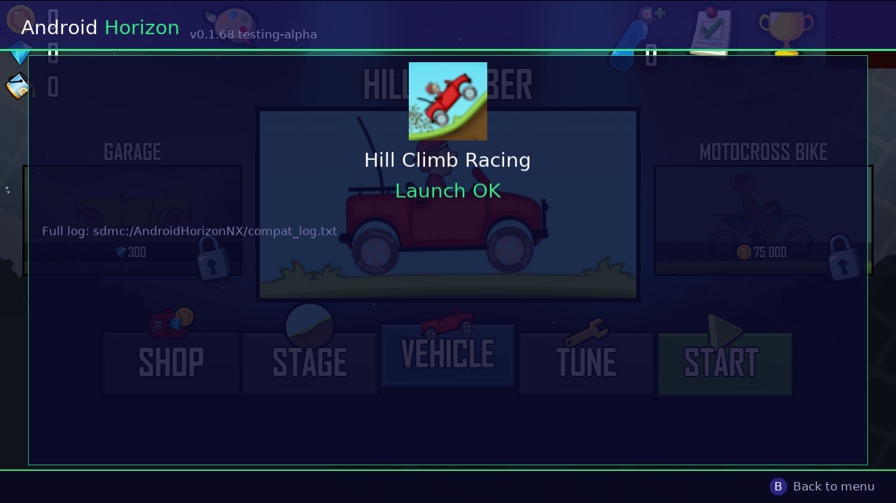
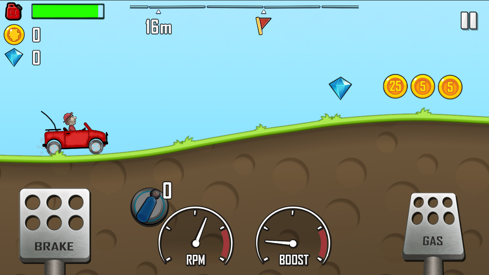

<div align="center">


# Android Horizon

**Run Android games natively on Nintendo Switch Horizon OS — without Android**

[](LICENSE)
[](https://github.com/Aaronateataco/AndroidHorizonNX/stargazers)
[](#status)
[](https://anthropic.com)
[](#)

*Made by [aaronworld.uk](https://aaronworld.uk) · [Give it a star ⭐](https://github.com/Aaronateataco/AndroidHorizonNX/stargazers) if you find it interesting!*

**[Website](https://androidhorizon.github.io/website/) · [Compatibility list](https://androidhorizon.github.io/website/compatibility.html) · [Docs](https://androidhorizon.github.io/website/docs/index.html) · [Releases](https://github.com/AndroidHorizon/AndroidHorizonNX/releases)**

</div>

---

> **Disclaimer — Please Read**
>
> Approximately **99.8% or more of the code in this project was written by Anthropic's Claude AI** (claude-sonnet-4-6). I (the author) am not a developer and am not capable of writing this myself. Claude and I are working on this together as an experiment. I handle testing on real hardware, describe problems, and decide direction; Claude writes and debugs the code.
>
> This project is in extremely early stages. It may not run anything at all reliably yet. Use entirely at your own risk.

---

## What Is This?

Android Horizon is a **compatibility / translation layer** that lets Android native (NDK) games run directly on the Nintendo Switch's **Horizon OS** — the Switch's real operating system.

**This is NOT Android running on the Switch.** There is no Android OS, no emulator, no virtual machine. The game's ARM64 machine code runs directly on the Switch's Tegra X1 processor, the same chip Android phones use. A thin shim layer fakes just enough of the Android runtime (libc, OpenGL ES, JNI, asset management) that the game's native `.so` library doesn't notice it isn't on Android.

Think of it like Wine on Linux — not emulation, but translation.

### Current Focus

We are currently only attempting **simple, old, 2D Android games** — specifically games that:

- Ship an `arm64-v8a` native library (`.so` file)
- Use OpenGL ES 2.0 or 3.0 for rendering
- Have **no** Google Play Services dependency
- Save locally (no cloud saves required)
- **Do not require network/online connectivity**

Our test target is **Hill Climb Racing 1.x** by Fingersoft — a simple 2D physics game with no online requirement, widely used in compatibility testing.

### What We've Achieved So Far

**Hill Climb Racing is playable on real Switch hardware.** Not "boots" — playable: touch-steering the car up the hill, engine and music audio, a locked 60 fps, in-game HUD, coins and gems. This is real Android NDK game code, unmodified, running directly on the Tegra X1 through switch-mesa — no Android OS anywhere in the loop.

The full pipeline that works today:

- The NRO launches from hbmenu (or an application-mode forwarder) with a themed APK browser UI
- APK extraction — native libraries and assets unpacked from the `.apk` onto the SD card
- All three ELF binaries (`libapplovin-native-crash-reporter.so`, `libquack.so`, `libgame.so`) load, relocate, and link against the shim table with **zero unresolved symbols**
- All **417 native C++ constructors** run clean, `JNI_OnLoad` completes, and real libnx threads run the game's background asset loader alongside the main render/game thread
- **Touch input** drives the car (steering/gas/brake) via the game's own registered touch natives — this is genuinely playable, not just rendering
- **Audio works** — engine sound, music, and effects via a custom SDL2_mixer backend reading OGG/MP3/Opus/FLAC straight from the APK's assets
- **A locked 60 fps** in normal play
- The fake JNI layer answers hundreds of thousands of calls (UserDefaults, market queries, AES encrypt/decrypt passthrough, audio engine hooks, real Switch connectivity status)
- Live on-screen log feed during loading, full diagnostics in `sdmc:/AndroidHorizonNX/compat_log.txt`, and **automatic screenshots** of key moments saved to `sdmc:/AndroidHorizonNX/screenshots/`
- Crash forensics: symbolized abort/exit backtraces with full frame-pointer backtraces, unrecovered-fault PC/region capture, and the game's own debug output routed into the log

**Known issues from hardware playtesting (see [Current Blockers](#current-blockers)):** the **Shop** screen crashes back out to the launcher, and save persistence needs another confirmed round-trip test (the mechanism is implemented and the log shows it loading/saving, but a full-restart verification is still outstanding).

The road here, each step root-caused on real hardware: JIT data pages needed RW after the executable transition (417 ctor faults) → `std::random_device` aborted because `/dev/urandom` doesn't exist (now served by the Switch CSRNG) → the asset-loader thread froze the game because `pthread_create` ran it inline (now real libnx threads) → a vorbis ABI mismatch corrupted the heap on the first sound effect (now uses the Tremor decoder SDL2_mixer actually expects) → an async Java callback (`fetchCountryCode`) left the post-EULA screen spinning forever (now answered immediately) → the engine sound played at full volume forever because its per-channel volume control was silently dropped (now wired through).

---

## Screenshots

**Every screenshot below was captured automatically by Android Horizon itself, on real Switch hardware** — the launcher saves a PNG of each UI screen to `sdmc:/AndroidHorizonNX/screenshots/`, and the game loop snapshots the actual GL framebuffer at milestone frames to prove what really rendered. None of these are mockups or emulator captures.

| | |
|---|---|
|  |  |
| *APK browser — starfield, planet horizon, HOS button glyphs* | *Live loading screen with real-time compat log* |
|  |  |
| *Launch diagnostics — confirms a clean load* | *Fingersoft splash animating (game frame 30)* |
|  |  |
| *Hill Climb Racing loading screen rendering on Horizon OS (frame 300)* | ***Actual gameplay*** *— touch-steering the jeep, live HUD, coins & gems, all on Switch* |

---

## Controls

> **Handheld mode only.** Android games use touch screen input. The Switch touchscreen only works in handheld mode — in docked mode there is no touch input, so games will be uncontrollable. Android Horizon detects docked mode and shows a warning in the footer.

**Android Horizon launcher controls (in the APK browser):**

| Button | Action |
|--------|--------|
| D-pad / Left stick / swipe | Navigate APK list |
| **A** / tap a game (tap again to launch) | Launch selected APK |
| **X** | Reinstall + Launch (re-extracts APK) |
| **Y** / tap footer | Rescan APK folder |
| **−** / tap footer | About screen (credits scroll via D-pad/stick/touch-drag) |
| **+** / tap footer | Quit |
| **B** | Back (on result/about screen) |

---

## Forwarders — a dedicated home-menu icon per game

Android Horizon can boot straight into one specific game, skipping the app-list picker entirely — the same idea as a RetroArch forwarder that jumps straight into a ROM+core instead of RetroArch's own content browser.

**How it works:** pass the game's package name (e.g. `com.fingersoft.hillclimb`) as the first argument when launching `AndroidHorizonNX.nro`. This uses libnx's standard `envSetNextLoad(path, argv)` chain-load mechanism — the same one homebrew forwarders (RetroArch included) use to hand a target path + argument string to the next NRO. Any forwarder tool whose NSP/NRO creation flow lets you specify a launch argument (not just a target path) can point at `AndroidHorizonNX.nro` this way; whether Sphaira's own forwarder builder exposes an argument field specifically hasn't been checked against its current version — worth confirming there first since that's what's already in use for launching Android Horizon itself.

If the requested package isn't installed (or the argument is stale/wrong), Android Horizon falls back to the normal app-list picker with an on-screen notice, rather than failing silently.

---

## Setup

1. Copy `AndroidHorizonNX.nro` to `sdmc:/switch/`
2. Place `.apk` files in `sdmc:/AndroidHorizonNX/apks/`
3. Launch from hbmenu (Atmosphere CFW required)
4. Navigate with D-pad or left stick, press **A** to launch
5. If a launch fails, check `sdmc:/AndroidHorizonNX/compat_log.txt` for the full error log

---

## Building

Requires [devkitPro](https://devkitpro.org/) with `devkitA64` and `libnx` installed.

As of 0.1.120, Android Horizon is split across **two repositories** as well as two NRO binaries — this repo builds the launcher/picker only; the actual game-loading "Translation Core" engine (plus the x32 placeholder) lives in **[AHNX-Translation-Core](https://github.com/AndroidHorizon/AHNX-Translation-Core)**. See [Architecture](#architecture--launcher--translation-core) below for why.

To build everything and get a drag-to-SD-card layout, clone both repos as siblings:

```sh
export DEVKITPRO=/opt/devkitpro
git clone https://github.com/AndroidHorizon/AndroidHorizonNX.git
git clone https://github.com/AndroidHorizon/AHNX-Translation-Core.git
cd AndroidHorizonNX
./build_all.sh
```

Output: `testingbuild/AndroidHorizonNX.nro` (copy to `sdmc:/switch/`) and `testingbuild/AndroidHorizonNX/` (copy the whole folder to `sdmc:/switch/AndroidHorizonNX/`) — drag the contents of `testingbuild/` straight onto the SD card.

Just want the launcher on its own? `make` in this repo builds `AndroidHorizonNX.nro` by itself. The Core repo has its own build instructions for its two pieces.

**Prebuilt releases** (no toolchain needed) are published on this repo's [Releases page](https://github.com/AndroidHorizon/AndroidHorizonNX/releases) — each one bundles the launcher plus both Translation Core builds, ready to drag onto an SD card.

### Dependencies (via pacman/devkitPro)

```
switch-sdl2 switch-sdl2_image switch-sdl2_ttf
switch-libpng switch-libjpeg-turbo switch-minizip
switch-mesa switch-glad switch-curl switch-mbedtls
```

---

## Architecture — launcher + Translation Core

Android Horizon is split into two pieces, in two separate repos, that chain-load into each other rather than being one monolithic binary:

- **[AndroidHorizonNX](https://github.com/AndroidHorizon/AndroidHorizonNX)** (this repo) → builds `AndroidHorizonNX.nro` — the picker. Scans `sdmc:/AndroidHorizonNX/apks/`, tags each APK with which native ABI(s) it ships, shows the list, and — on launch — hands off to the right engine via `envSetNextLoad(path, argv)` (the same chain-load mechanism [forwarders](#forwarders--a-dedicated-home-menu-icon-per-game) use), passing the package name as `argv[1]`. It has no ELF loader, JNI shim, or game-engine code of its own at all — this repo is deliberately small.
- **[AHNX-Translation-Core](https://github.com/AndroidHorizon/AHNX-Translation-Core)** → builds `AHNX-Translation-Core-x64.nro` — the real engine: everything this README describes above (ELF loading, JIT, the JNI/Bionic compat layer, audio, sensors, the whole thing). It always expects a package name in `argv[1]` — launching it directly without one just shows a message pointing back at the launcher, it's not meant to be run standalone. The same repo also builds `AHNX-Translation-Core-x32.nro` — a placeholder. **32-bit (`armeabi-v7a`) binaries are not supported at the moment** — running AArch32 code on Switch is possible in principle (there's real prior art for it via a per-title Atmosphere address-space override), but the one real precedent project we found for this depends on a 32-bit build of libnx that isn't publicly available anywhere, and building one from scratch is a substantial, uncertain undertaking of its own. The launcher detects 32-bit-only APKs during scanning and blocks launching them with an explanation, rather than attempting to chain-load into this placeholder — it exists to complete the on-disk layout, not because it does anything yet.

Why split it this way: the two execution states (AArch64 for 64-bit games, AArch32 for a hypothetical future 32-bit engine) can't coexist in one running process — a Switch process runs in one execution state for its whole lifetime. Splitting the picker out from the engine means adding a real 32-bit engine later is "point the launcher at a new NRO," not "rewrite everything." Splitting them into separate *repos* on top of that keeps the launcher (small, stable, rarely needs to change) decoupled from the engine (where almost all the actual development happens) — releases and issues for "the app won't launch" versus "the game crashes" land in the right place instead of one giant repo mixing both concerns.

---

## Current Blockers

These are the known issues preventing Hill Climb Racing from running:

### 1. ~~Code pages not executable~~ — **RESOLVED**

The ELF loader now uses the SplitMap technique: two `svcCreateCodeMemory` handles placed at adjacent virtual addresses. The code segment is mapped `MapSlave` (Rx) and the data segment `MapOwner` (Rw). ARM64 ADRP instructions can address ±4GB, so adjacent placement lets executed code reach GOT/data without any permission transitions. The old `0xD801` error no longer occurs.

### 2. ~~JMPREL unresolved~~ — **RESOLVED (all 403 entries)**

All 403 JMPREL entries in the crash reporter library resolve successfully. The test log confirms `JMPREL: all 403 entries processed` and `ELF: jmprel done`.

### 3. ~~SplitMap memcpy crash~~ — **RESOLVED**

After JMPREL, the ELF loader was crashing on `memcpy(code_heap_buf, ...)` because `svcCreateCodeMemory` was called too early, making the backing buffer inaccessible before we wrote to it. Fixed: `svcCreateCodeMemory` + `svcControlCodeMemory` are now deferred until after the memcpy.

### 4. ~~Native constructors~~ — **RESOLVED (all 417 run clean)**

Root cause: `jitTransitionToExecutable` made the entire JIT region RX, including the data segment, so the very first constructor writing a C++ global hit a permission fault. Fix: data-segment pages are flipped back to RW after the executable transition, matching the Android linker's layout. `ctors done ok=417 failed=0`.

### 5. ~~Game calls `abort()` after ~165s~~ — **RESOLVED**

Root cause: `std::random_device`'s constructor opens `/dev/urandom`, which doesn't exist on Horizon OS; the `-fno-exceptions` build turns that failure into an instant `abort()`. Fixed by serving `/dev/urandom` as a virtual file backed by the Switch's hardware RNG.

### 6. ~~No audio~~ — **RESOLVED**

A custom SDL2_mixer backend now serves every SimpleAudioEngine JNI call — background music and sound effects (OGG/MP3/Opus/FLAC) decode straight from the extracted APK assets. Per-channel effect volume (used for the engine sound) is wired through; per-channel *pitch/rate* is not — SDL_mixer has no API for changing an individual channel's playback speed without a full custom resampling engine, so the engine note doesn't rise and fall with RPM yet (volume does).

### 7. ~~Background threads run synchronously~~ — **RESOLVED**

`pthread_create` now spawns real libnx threads (pinned off the render core), with real mutexes/condvars/semaphores/rwlocks backing the game's synchronization primitives.

### 8. ~~Touch input not delivered~~ — **RESOLVED**

Confirmed on hardware: SDL finger events drive the game's own touch natives, and the car is fully steerable.

### 9. Shop screen crashes back to the launcher — **ACTIVE INVESTIGATION**

Opening the in-game Shop crashes out to the Android Horizon menu. No fault or abort was captured in the log from the crash session (the log simply stops mid-stream with no exit marker), which pointed at a possible deadlock in the crash-forensics logger itself: if the crashing thread happened to fault while already holding the log's mutex (e.g. mid-format inside an ordinary log call), the old fault handler would try to take that same mutex to report the crash and hang forever — a real bug, now fixed with a lock-free emergency logger for exactly this scenario. The Shop is also the most network/IAP-heavy screen, and until this build `isNetworkAvailable` always claimed "online" regardless of the Switch's actual connection — an offline Switch reporting itself online could easily send the game into a real network call that has no chance of succeeding. Both fixes are in; needs a fresh test + log to confirm.

### 10. Save persistence — needs a confirmed round-trip test

The UserDefault store now loads from and saves to `<game>/userdefaults.bin` (ints, floats, bools, strings), and the compat log shows it loading and saving correctly during play. However this hasn't yet been confirmed by a full app-restart-and-relaunch test on hardware, so treat it as "implemented, not yet verified" rather than "working."

### 11. One game session per app launch

Launching a second game session in the same Android Horizon process reads garbage ("not an ARM binary") — leftover JIT memory regions and threads from the first session aren't unloaded. Currently guarded with an on-screen notice instead of a crash; a real unload path is future work.

---

## Performance Expectations (Hill Climb Racing 1.67.0)

We're testing the `.apk` release of **Hill Climb Racing 1.67.0** specifically — the current Play Store release ships as a `.xapk`. Android Horizon's APK parser only understands plain `.apk` files right now, so `.xapk` support is out of scope until a later phase.

Measured numbers from hardware:

- **A locked 60 fps during actual gameplay** — the theoretical ceiling is also the measured result. (Earlier builds measured ~18 fps in the menu before a logging bottleneck was found and fixed — see the 0.1.65 changelog entry — real gameplay performance is native-class.)
- Loading time has come down substantially since the early ~143 s measurement, once JNI log spam (thousands of save-key reads, each fsyncing to the SD card) was throttled — see 0.1.65.
- Hill Climb Racing was tuned for 2012-era phones far weaker than the Tegra X1, so there's little pressure on performance work right now; focus is on correctness (Shop crash, save verification) over speed.

---

## Game Compatibility List

**Honest status check first:** only one game has ever actually been run against this project — **Hill Climb Racing 1.67.0**. There isn't a roster of other "integrated" games yet. Everything below is what the compat layer's actual API surface supports or is missing, so it's clear what a new game would need before it could be tried — not a list of titles confirmed to work.

| Game | Status | Notes |
|---|---|---|
| **Hill Climb Racing** 1.67.0 (Fingersoft) | ✅ Playable | The only game tested. Fully playable — touch controls, real audio, real threads, persistent saves, ~locked 60fps. One known deterministic crash on the Shop/IAP screen (root-caused, not yet patched — see Changelog). |
| **Angry Birds Classic** ("WebPit" community build 7.3.0) | ❌ Unsupported | 32-bit only (`armeabi-v7a` + `x86`, no `arm64-v8a` at all — checked every entry in the APK directly). This specific build can't run here; a build that ships `arm64-v8a` (e.g. Rovio's later "Rovio Classics" rebrand, unconfirmed) would have a real chance. |

The launcher now tags each scanned APK by architecture automatically and blocks launching anything 32-bit-only with an explanation, rather than only finding out after a failed extraction.

**What a game needs, to have a real chance:**
- `arm64-v8a` native libraries in the APK (`lib/arm64-v8a/*.so`) — this project only loads AArch64 ELF binaries. ARM32-only (`armeabi-v7a`) APKs are detected during scanning and blocked with an explanation (see [Architecture](#architecture--launcher--translation-core)) rather than attempted.
- A plain `.apk` — the extractor doesn't understand split/`.xapk` packages yet (see Performance Expectations above).
- An engine that talks to "Android" through native JNI callbacks to a handful of Java-side helper classes (the cocos2d-x `SimpleAudioEngine`/`UserDefault`/activity-callback pattern HCR uses) — that's the actual, tested API surface this project emulates. A game built this way has a real chance even if it's never been tried.

**What almost certainly won't work without a lot more work:**
- **Unity games** (`libunity.so`/IL2CPP) — a completely different native runtime and JNI surface than what's implemented; nothing here targets it.
- **Games leaning on Google Play Services** (Play Games sign-in, real ads, real IAP, Firebase, etc.) — those are stubbed out/no-op'd, not implemented (see "Not Planned" in the Roadmap below). A game that *requires* one of these to function past a login/paywall screen won't get past it.
- **Anything needing real network multiplayer.**

**If you want another game supported:** the process that got Hill Climb Racing working was: provide the `.apk` (and any `.obb`/expansion file), then real hardware iteration — extract it, see what JNI calls and native symbols it actually makes, implement/stub what's missing, rebuild, test on your Switch, repeat. That loop needs a real APK to extract and real hardware to test against; it's not something to fake from documentation alone. Send over an APK for whichever game you have in mind and that process can start for real.

---

## TODO / Roadmap

> Items are roughly ordered by priority. "Phase 0" is the current work.

### Phase 0 — Make any game do *something* (in progress)

- [x] APK browser UI with icon extraction
- [x] APK extraction (libs + assets) onto SD card
- [x] Custom ARM64 ELF loader with RELA relocation
- [x] JNI environment shim (fake JavaVM / JNIEnv)
- [x] EGL setup (GLES 2 + 3 shim table passthrough)
- [x] On-screen progress display during launch stages
- [x] Full diagnostic result screen with error details
- [x] Docked mode detection — footer warns when not in handheld mode
- [x] Early abort when code pages are not executable — shows diagnostic screen instead of crashing Switch
- [x] **SplitMap JIT** — adjacent RW+Rx dual-mapping via two `svcCreateCodeMemory` handles; 0xD801 blocker resolved
- [x] All 120+ unresolved symbols shimmed
- [x] **Per-constructor logging** — crash site shows in `compat_log.txt`
- [x] **Load all .so files** — all three libs loaded smallest-first; cross-library symbols available before constructors run
- [x] **40+ additional shims** — signal handling, thread naming, memory, barriers, etc.
- [x] **Live progress screen** — loader runs on a background thread; main thread renders at ~60fps with animated scan bar and live `compat_log.txt` tail (13 lines, colour-coded)
- [x] **Elapsed time per stage** — stage label shows "(Xs)" so you can tell how long each step is taking
- [x] **All 403 JMPREL entries resolved** — confirmed in hardware test
- [x] **All 417 constructors run clean** — JIT data pages flipped back to RW after executable transition
- [x] **Game boots and renders** — splash animation, full loading screen, menu logic, ~18 fps
- [x] **Crash forensics** — symbolized abort/exit backtraces, unrecovered-fault PC capture, game stderr + debug strings routed to compat log
- [x] **Automatic screenshots** — launcher screens + GL framebuffer at milestone frames saved to `sdmc:/AndroidHorizonNX/screenshots/`
- [x] **Fixed the ~165s `abort()`** — root cause `/dev/urandom` missing on Horizon OS, served by the Switch CSRNG
- [x] **Touch input delivered** — SDL finger events → Cocos2dxRenderer touch natives (1:1 coords); B button → Android BACK key; **confirmed steering the car on hardware**
- [x] **Audio playback** — SDL2_mixer backend for SimpleAudioEngine (music + effects, OGG/MP3/Opus/FLAC); **confirmed working on hardware** (engine, music)
- [x] **GAME IS PLAYABLE** — driving, touch, audio, 60fps, confirmed on Switch hardware
- [ ] Shop screen crash (active investigation — see Current Blockers #9)
- [ ] Confirm save persistence survives a full app restart

### Phase 1 — Touch input

- [x] Map Switch touchscreen events to the game's touch natives (direct `Java_...nativeTouches*` calls rather than the `AInputQueue`/`ALooper` path — simpler and confirmed working)
- [x] Docked-mode detection — footer shows warning when not in handheld mode

### Phase 2 — Stability

- [x] **Real `pthread` support using libnx `Thread`** — real threads, real mutex/condvar/rwlock/semaphore backing
- [x] Load all `.so` files in dependency order (smallest-first)
- [ ] Implement `dl_iterate_phdr` so stack unwinders work
- [x] **Save/load state** — UserDefaults persist to `<game>/userdefaults.bin` (needs a confirmed restart test, see blockers)
- [ ] Real `.so`/JIT unload so a second game session doesn't require restarting the app
- [ ] Engine/effect pitch control (needs a custom audio resampler — SDL_mixer has no per-channel rate API)

### Phase 3 — Polish

- [x] NRO icon (Android Horizon themed — green planet with curved text)
- [x] **Icon-themed UI** — animated starfield, planet-horizon scenery, borealis-style glowing focus card, HOS button glyphs from the system font
- [x] GitHub avatar on About screen (bundled static image — no runtime fetch)
- [x] About screen (press **−**)
- [x] Reinstall button (**X** in APK list)
- [x] Version bump system — NACP + in-app version both track the build number (`0.1.<build>`)
- [ ] Per-APK settings overlay (resolution, framerate cap)
- [ ] APK delete / manage from the UI

### Phase 4 — Real controller support (docked mode)

Hill Climb Racing has **native MOGA controller support already built in** — confirmed two ways: the extracted APK assets include reference button-layout images for both the **MOGA Pro** (dual analog sticks + shoulder buttons) and **MOGA Pocket** (compact, single stick + d-pad) controllers, and the compat log shows the game actually reading persisted onboarding flags for them (`moga_pro_guide`, `moga_pocket_guide`). MOGA controllers used a standard Xbox-style face-button layout — **A bottom, B right, X left, Y top** — which is diagonally swapped from the Switch's own layout (**A right, B bottom, X top, Y left**). That means real Joy-Con/Pro Controller support for this game specifically could be a relatively short path: map Switch physical buttons to the game's expected MOGA input, swapping **A↔B and X↔Y** so the face buttons land where the game expects them, rather than needing a full custom input scheme. This wouldn't need any game-side changes — cocos2d-x already listens for MOGA-style gamepad input, we'd just need to feed it.

This is the real blocker on docked mode: right now only touch input is implemented (handheld-only), which is why docked mode is disabled entirely — there's no controller input path yet at all, MOGA-shaped or otherwise. Not started; noted here as a promising, concrete lead for whoever picks this up next (PRs welcome).

### Phase 5 — "Feels like real Android" device APIs

- [x] **Real accelerometer** — the actual Android NDK Sensor API (`ASensorManager`/`ASensorEventQueue`), backed by the Switch's real handheld six-axis sensor. Untested against a live game (Hill Climb Racing doesn't use it) — ready for a future tilt-control game.
- [x] **Real battery percentage + charging status** — via libnx `psm`, exposed under the common Android SDK method-name patterns since there's no pure-NDK battery API to target precisely. Same caveat: untested against a live game.
- [x] **Real gyroscope** — same six-axis sensor reading already used for the accelerometer also carries angular velocity; now exposed as a second `ASensor` (`ASENSOR_TYPE_GYROSCOPE`) through the same real NDK API, converted from the Switch's revolutions/sec to Android's expected radians/sec. `ASensorEventQueue_getEvents` returns both events from one `hidGetSixAxisSensorStates` call per poll if a game enables both sensors. Same caveat as accelerometer: untested against a live game.
- [ ] Real device info (model name, OS version strings) for games that branch on it — deliberately not started yet: our JNI layer returns the same dummy `jclass`/`jfieldID` for every `FindClass`/`GetStaticFieldID` call (fields aren't tracked by identity the way methods are), so faking `android.os.Build.MODEL` etc. needs a real refactor of static-field dispatch, not just a new case — bigger and riskier than it looks, holding off until a game actually needs it.

### Idea — Mii driver support

Aaron's idea: replace Hill Climb Racing's driver character with the player's own Mii. Investigated the game's assets (`assets/driver-*.png`, `assets/bike-driver-*.png`) to check feasibility — the driver is **not** a single flat sprite but a modular Box2D ragdoll rig built from separate pieces (`driver-head.png`, `driver-body.png`, `driver-beard-part1/2.png`, `driver-hat-extension-part1/2.png`, plus a whole parallel set of `bike-driver-*` parts for the bike vehicles). It already supports full seasonal re-skins this way (`driver-head-santa.png`, `driver-head-vampire.png`, `driver-body-santa.png`, etc.), which is good news — it means the pipeline for swapping *just the head* while keeping the rest of the rig already exists in the game itself.

Concrete technical path for later: libnx's `account` service can fetch the current Switch user's actual profile picture via `accountProfileLoadImage` — for most users this **is** a rendered image of their Mii's face, returned as a plain JPEG. That could be decoded and patched over `driver-head.png` (and the seasonal variants) using the exact same asset-patch pipeline already built for the MOGA controller image (`applyGamePatches()` in `loader.cpp`) — no new infrastructure needed, just a new patch table entry plus the account-image fetch. Not started — noted here as a scoped, buildable idea for a future session.

### Long-term vision

If this approach proves out across many games (not just Hill Climb Racing), the plan is to grow it into a **Tico emulator core** — a proper, reusable core for running Android games natively, rather than a single-game-at-a-time compat layer. Not started, not scoped yet — noted here as the long-term direction this project is aiming toward.

### Not Planned (for now)

- Online / multiplayer games (Roblox, Fortnite, etc.)
- Google Play Services (GMS) stub
- ARM32 (`armeabi-v7a`) game support — Switch is 64-bit only

---

## Changelog

> Most recent first.

### 0.1.121 — Touch navigation, in-app contributor credits, and the project website

- [x] **Full touch-screen navigation in the launcher**, alongside the existing D-pad/stick/button controls: tap a game row to select it (tap the already-selected row again to launch — mirrors pressing A after moving the cursor there), swipe to scroll the list, and tap footer buttons (Launch/Reinstall/Rescan/About/Quit) directly. `drawFooterBar()` now records each hint's on-screen hitbox as it draws (positions are text-width-dependent, so this was the only reliable way to hit-test it).
- [x] **Scrollable, categorized contributor credits** in the About screen, sourced from a plain-text `romfs:/contributors.txt` that the release workflow regenerates from the live GitHub org (grouped per-repo) on every build — D-pad/stick/touch-drag all scroll it.
- [x] **Release workflow now publishes only the bundled SD-card zip** — the individual launcher/Core-x64/Core-x32 NROs are build intermediates, not something to grab individually and drop in the wrong place.
- [x] Confirmed all three org repos (`AndroidHorizonNX`, `AHNX-Translation-Core`, `website`) carry byte-identical `LICENSE` files.
- [x] **Built the project website** — a static site (landing page, an honest [compatibility list](https://androidhorizon.github.io/website/compatibility.html) mirroring the one below, and [docs](https://androidhorizon.github.io/website/docs/index.html) covering setup/controls/architecture/building) — live at [androidhorizon.github.io/website](https://androidhorizon.github.io/website/), deployed via GitHub Pages from the `website` repo's `main` branch.

### 0.1.118 — First real stall data, and a self-inflicted stutter found immediately

The frame-stall logging paid off on its very first real test. Highlights from the first session's `compat_log.txt`:

- [x] **Removed a stall we were causing ourselves.** The frame-900 milestone screenshot (`saveGameScreenshot`) landed exactly on a logged 1032ms stall — `glReadPixels`/`IMG_SavePNG` are both genuinely expensive, and this ran on every single test session for no ongoing benefit once the images it produces were already captured and embedded in the README. Removed the capture entirely (dead code, since it's not called anywhere else).
- [x] **Quantified the actual UserDefault save cost**: even now that saves are debounced to at most once per 2s, each real write still takes ~700-900ms by itself (two separate 805ms/763ms stalls both landed immediately after `UserDefaults: saved 5302 ints...` in the log) — serializing 5000+ entries and writing them to the SD card is just inherently slow, independent of how often it happens. Not fixed yet — the safe fix (moving the actual write to a background thread) needs more careful concurrency handling than a quick patch; noted as a real, quantified target rather than fixed blind.
- [x] **Found the single worst stutter in the whole session**: an 8.3-*second* freeze (frame 348), landing exactly on the game loading 33 "event textures" back to back in one synchronous burst. This is a real, first-party engine behavior (decoding a whole batch of textures with nothing yielding control in between) — not something fixable from the compat layer without hooking the game's own texture-loading calls, a much bigger undertaking than anything attempted so far.
- [x] Confirmed the entire loading phase (roughly frame 150-320, an ~12 second span) stalls on nearly every single frame (40-120ms+ each) — matches everything already known about loading being CPU-heavy, now precisely quantified rather than just "felt slow."

### 0.1.117 — Frame-stall logging

Now that the launcher → Translation Core handoff is confirmed working on hardware, added the diagnostic tooling needed to actually chase down remaining stutter with evidence instead of guesswork.

- [x] **Every real frame stall is now logged with its exact duration.** Measures real wall-clock time between one completed frame (right after its `eglSwapBuffers`/`SDL_GL_SwapWindow`) and the next — a steady 60fps session takes ~16.6ms/frame, so anything well past that for a single frame is a genuine, momentary hitch, not measurement noise. Logs `stall: frame N stalled for Xms`, or `STALL(severe): ...` past 100ms for the ones bad enough to actually feel like a freeze. Silent the rest of the time — a real stall is a rare event, not per-frame telemetry, so a disk write per occurrence is fine (nothing like the earlier per-frame logging bugs this project already hunted down and fixed).
- Next play session's `compat_log.txt` should make it straightforward to correlate stalls with whatever else was happening at that exact frame number (scene transitions, new-texture streaming, JNI activity nearby in the log) — turning "it feels stuttery sometimes" into a concrete list of exactly where to spend optimization effort next.

### 0.1.11x — The real fix for the launcher → Translation Core handoff crash

`launcher_log.txt` from the first hardware test showed the handoff itself succeeding (`envHasNextLoad: true`, `envSetNextLoad OK`) — so the previous argv[1]→argv[0] change wasn't the actual problem. The Translation Core's own `log.txt` from the same attempt showed the real cause: every font load failing immediately (`BFTTF open failed` + `romfs font open failed` for all three fonts), which fails `app.init()` and exits before ever reaching game-loading code — explaining "Software closed".

- [x] **Root cause: `argv[0]` has a special, required meaning to libnx itself.** `romfsInit()` falls back to `argv[0]` to find and open its own `.nro` file on the SD card and read its embedded RomFS section — confirmed against libnx's actual RomFS-mounting behavior. The previous fix had the launcher pass *only* the package name as the whole argv string, which put it in `argv[0]` — overwriting the real path libnx needed internally, so RomFS silently failed to mount and every `romfs:/...` font load failed immediately after. Fixed properly this time: the launcher now passes `"<Core's own path> <package name>"` (two words), so `argv[0]` stays the real path libnx needs and the package name lands at `argv[1]` — the Core reads `argv[1]` again, but now it actually gets there for the right reason.
- [x] **Found and fixed a second, unrelated bug while investigating**: the launcher's own `romfs/` folder was missing `background.svg` (copy-paste oversight when splitting the project) — harmless (falls back to a flat background) but fixed.
- [x] Added an early diagnostic log line (to `log.txt`, opened well before `compat_log.txt` exists) recording the exact `argc`/`argv[0]`/`argv[1]` the Core actually received, so any future handoff issue is diagnosable immediately instead of needing another round-trip.

### 0.1.109 — Split into launcher + Translation Core; 32-bit APKs detected and blocked

Triggered by trying an Angry Birds Classic build that turned out to be 32-bit-only (`armeabi-v7a`/`x86`, no `arm64-v8a`). Researched whether AArch32-on-Switch is achievable at all (it is, in principle — real prior art exists) but it needs a 32-bit libnx build that isn't publicly available anywhere, so it's parked as a documented placeholder rather than attempted blind.

- [x] **Architecture detection during scanning**: `ApkInfo` now has an `arch` field (`Arm64` / `Arm32Only` / `Unknown`), detected by checking which `lib/<abi>/` folders an APK actually contains — no more finding out only after a failed extraction attempt.
- [x] **Split into three NROs**: `AndroidHorizonNX.nro` (new `launcher/` project — scans, lists, tags, and chain-loads) hands off to `AHNX-Translation-Core-x64.nro` (the actual engine — everything this README describes, unchanged internally, just no longer has its own interactive picker) via the same `envSetNextLoad` mechanism already built for external forwarders. `AHNX-Translation-Core-x32.nro` is a placeholder that explains why 32-bit isn't supported yet. `./build_all.sh` builds all three and arranges them into `testingbuild/` matching the real SD-card layout (launcher + a subfolder holding both cores) — drag its contents onto the SD card.
- [x] **32-bit APKs are now blocked with a clear, honest message** ("32-bit binaries aren't supported at the moment — there isn't enough public documentation available to support this safely yet") instead of a cryptic "No arm64 .so found" failure partway through extraction.
- Not yet hardware-tested: the chain-load hand-off between launcher and Translation Core (envSetNextLoad targeting our own sibling NRO, not an external forwarder) is a new use of an already-proven mechanism — compiles clean on all three targets, but the actual handoff needs a real test on Aaron's Switch.

### 0.1.108 — Deeper prior-art review: mostly validation, one robustness addition

Went back through the credited projects more thoroughly per Aaron's request to "completely check all of these" — cloned and read `ffd_nx` (Final Fantasy Dimensions' Switch port)'s actual source directly, including its fake-JNI layer, not just a summary.

- [x] **Validated our JNI dispatch approach.** ffd_nx's own fake-JNI layer (a real, shipped, cocos2d-x-adjacent Switch Android port) uses the exact same "chain of string comparisons" dispatch style we do — good independent confirmation that this is normal, accepted practice in this niche, not something that needs restructuring for performance (matches the conclusion reached a couple of rounds ago).
- [x] **Found a real, if narrow, robustness gap and hardened it defensively.** Our ELF loader's memory-mapping assumes a game's `.so` has exactly one contiguous executable region followed by one contiguous writable region — true for every binary this project has loaded so far, but not something the ELF format actually guarantees. A more general version of this same mapping technique (handling arbitrary segment layouts) exists in this ecosystem. Rather than rewrite our own working, hard-to-test memory-mapping code speculatively, added a validation check that logs a clear warning if a future game's `.so` ever has more than one executable or writable segment — so a weird crash on a *new* game points straight at this assumption instead of being a fresh mystery.
- Honest framing: most of this deeper pass came back as confirmation that the existing design is sound, not a pile of new bugs — which is itself a useful, if less dramatic, result.

### 0.1.107 — Two safety practices adopted from prior art, plus the shop-crash finally fully explained

- [x] **Preflight syscall check**: `launchApk()` now verifies `svcCreateCodeMemory`/`svcControlCodeMemory` are actually available (`envIsSyscallHinted`) before attempting any ELF/JIT work, with a clear error naming exactly what's missing — instead of a much more confusing failure partway through loading if the CFW/environment doesn't grant them.
- [x] **Poison value for unresolved symbols**: any import we can't resolve now gets a distinctive out-of-range address (`0xBAD0BAD0BAD00000`) instead of a plain null — if a bug ever actually reaches one, the crash log is immediately recognizable as "hit an unimplemented import" rather than an ordinary null-pointer mystery.
- [x] **Fully root-caused the deterministic Shop/IAP crash** (finally, via `.eh_frame` unwind-table lookup pinpointing the exact function boundaries — a technique this round's research surfaced). It's a generic `std::vector` append helper being handed an invalid *reference* by its caller — decoded the exact math: the caller computes something equivalent to `products[products.size() - 1]` on an **empty** product list, which underflows to address `0xFFFFFFFFFFFFFFF8` (-8), then passes that as a reference to copy from. Since our compat layer reports zero real IAP products (no real store), this path is always empty — explains why it's 100% deterministic. Not patched yet (see below) — this is a real, understood bug, with a concrete fix path, not fixed blind.

### 0.1.106 — Performance audit: the real fix for the in-driving stutter

Went back through the compat layer specifically looking for real, avoidable overhead rather than more speculative tuning — one genuine find, plus a couple of defensive improvements:

- [x] **Found the actual file-read path behind the confirmed in-driving stutter.** Build 102's 64KB buffering fix only touched `stub_fopen` — the game's own *direct* `fopen()` calls. But cocos2d-x on Android reads assets (including the streamed scenery textures behind the earlier thread-tagged "main thread doing PNG decode" finding) through the NDK `AAssetManager` API, not raw `fopen`, which in our compat layer is a *separate* code path (`asset_open` in shim_table.cpp) that was still using newlib's tiny default buffer this whole time. This is very likely the actual mechanism behind the stutter, more so than the earlier fix — same 64KB `setvbuf` treatment now applied there too.
- [x] **JNI method lookup is now O(1) instead of O(n).** `GetMethodID`/`GetStaticMethodID` resolution did a linear scan over every distinct method the game had looked up so far (potentially 100+ by mid-session) — added a hash-map index alongside the existing stable storage pool, so lookup time no longer grows with how long the game's been running.
- [x] Same treatment for the log-dedup helper (`logOnce`): `std::set` (O(log n) tree) → `std::unordered_set` (O(1) average) — this fires for every unique JNI call/key across a session.
- [x] Removed a dead, unused variable found during the audit (`g_logged_int_keys` — leftover from an earlier dedup approach, superseded by `logOnce`, never actually referenced).
- Honest framing: this is a real, evidence-based pass, not a claim of "perfect" performance — the two confirmed, fixable overhead sources found this session are addressed; the game's own internal engine behavior (how cocos2d-x streams and decodes textures) is still not something we control directly.

### 0.1.105 — Forwarder support + SVG background

- [x] **Forwarder / direct-launch support**: Android Horizon now reads `argv[1]` as a package name to boot straight into, skipping the app-list picker entirely — the same mechanism RetroArch forwarders use (`envSetNextLoad(path, argv)`) to jump straight into a ROM+core instead of RetroArch's own content browser. A small forwarder NRO (Sphaira, hbmenu, or anything that can chain-load with an argument) pointed at `AndroidHorizonNX.nro` with a game's package name now gets its own dedicated "launch this one game" icon on the home menu. If the requested package isn't found/installed, it falls back to the normal picker with an on-screen notice instead of failing silently. A successful session already exits the whole process directly from inside the game loop (see the 0.1.102 fix below), so a forwarder-launched game closes straight back to the Switch home menu, never through our own UI.
- [x] **Launcher background is now a real SVG**, rasterized once at startup instead of ~50 lines of hand-coded scanline gradient/circle math. Turns out devkitPro's SDL2_image portlib already bundles `nanosvg` internally for exactly this (found out the hard way — vendoring our own copy collided at link time with symbols already inside `libSDL2_image.a`), so this ended up being a plain `IMG_Load("romfs:/background.svg")` call, same as any other image this project loads. The animated twinkling starfield is unchanged (still drawn fresh every frame in C++, since that's genuine per-frame animation a static raster shouldn't own) — only the static sky/planet/horizon-glow layer moved to `romfs/background.svg`, easy to open and re-art-direct in any real vector editor going forward.

### 0.1.102 — Fixed the + button flicker (same bug as the crash flicker, different trigger)

- [x] **Found and fixed "+ makes everything flicker"**: the original crash-flicker fix (exiting cleanly via `exit(0)` instead of returning to the launcher in the same process) only applied when the game loop exited via a caught crash. Pressing + to quit deliberately exits the exact same loop through a different path (`crashed` stays false), which fell through to the OLD return-to-launcher cleanup — the same one proven to flicker, because any real background thread the game spawned (e.g. its own asset loader) doesn't care *why* the loop ended, only that it might still be running and racing the launcher's renderer. Now exits unconditionally on any game-loop exit, not just crashes.
- [x] **Investigated "audio goes out of sync for a bit" right at the end of the loading screen**: found the game's music-track switch (loading music → gameplay music) calls into SDL_mixer's `Mix_LoadMUS` synchronously, at the *exact* same moment the branding overlay hides and CPU boost mode resets — a real contention point. Added a decoded-music cache (mirrors the existing sound-effect cache) so any track played more than once — returning to a menu, revisiting a stage — skips the reload entirely, and properly wired up `preloadBackgroundMusic` (previously a silent no-op) so a game that preloads ahead of time actually benefits. Doesn't eliminate the very first play of a brand-new track, so may not fully resolve this specific report — worth another log to see if it's better.

### 0.1.101 — Real gyroscope

- [x] Extended the existing real accelerometer implementation to also expose a real gyroscope through the same NDK Sensor API — no new hardware access needed, the six-axis sensor read already carried angular velocity, it just wasn't surfaced as a second sensor yet. Untested against a live game like its accelerometer sibling (Hill Climb Racing uses neither) — groundwork for a future motion-control game.
- [x] Looked at implementing real `android.os.Build` device-info strings (model/OS version) too, but our JNI layer doesn't track static fields by identity (`GetStaticFieldID` returns the same dummy handle regardless of field name) — doing this properly needs a real dispatch refactor, not a quick addition. Held off rather than bolt on something that only half-works.

### 0.1.99 — Diagnostics for the in-driving freeze + volume reports

Tested build 98 on hardware: a full 114s driving session ran at a solid ~55-60fps average (heartbeat log), but "still lags at times and like freezes whilst driving" reported. The coarse 15s heartbeat can't show a brief hitch, so this build adds targeted instrumentation rather than a blind fix — a real fix without proof of root cause risks masking the wrong thing.

- [x] **Thread-tagged stdio capture**: `game stdio[tid=...]` lines now include which thread produced them, and the main/render thread's own tid is logged once at startup as a reference. The log showed repeated `libpng warning: iCCP` lines *during* active driving (new textures streaming in as the car progresses) with no corresponding background-thread creation nearby — next log will show definitively whether these decodes are landing on the render thread itself (the likely stutter cause) or a thread we just couldn't see before.
- [x] **Volume investigation**: found `setBackgroundMusicVolume`/`setEffectsVolume`/`setEffectVolume` were completely silent (by original design, to avoid log spam), and so were `setBoolForKey`/`setFloatForKey` — meaning a volume slider (almost certainly persisted as a float, or muted via a bool) left literally no trace in the log. All four now log their actual values (the high-frequency per-frame one, `setEffectVolume`, throttled to 2/sec like the other continuous channels so it doesn't reintroduce the stutter that throttling fixed). Next log will show the actual numbers behind "same toggle position, different loudness."
- [x] Confirmed from the same log *why* the IAP-guard can't stop the deterministic crash: it fired again after finishing a race (post-race ad/rewarded-video flow → `trackPage(iap/playstore/view)` → fault, same second) — same root cause as before, not a regression.

### 0.1.97–0.1.98 — Real Switch-hardware CPU boost + redundant-save fix

Approached this round of stutter/perf work the way a Switch porting engineer would: not more log-throttling, but the actual hardware lever real titles use to control clocks — libnx's `apm`/`appletSetCpuBoostMode` API. Tested on hardware immediately after (fresh log) — the boost alone "didn't seem faster", which pointed at a second, disk-I/O-bound bottleneck in the same window that a CPU clock boost can't touch.

- [x] **CPU boost (`ApmCpuBoostMode_FastLoad`) now engages during every CPU-bound, GPU-idle phase**: our own APK-extract/ELF-relocate/JIT-map loader thread, *and* the game's own native init + splash + "HILL CLIMB RACING / LOADING..." screen. FastLoad raises CPU clocks but throttles the GPU to its minimum — exactly the right trade while nothing meaningful is being drawn, and exactly what retail games do on their own loading screens.
- [x] **Boost drops back to Normal automatically** the moment real gameplay/menu rendering starts — reusing the already-hardware-confirmed `trackPage` signal (`compatMarkPastLoading()`) as the "GPU needs its clocks back" trigger, and unconditionally after our own loader thread joins, so it can never get stuck on.
- [x] Reviewed thread/core placement for contention: worker `pthread_create` threads are round-robin pinned across cores 1/2, main game thread/render loop stays off both — confirmed still correct, no change needed here.
- [x] **Found a real second bottleneck in the same log**: during the loading burst the game called `UserDefault.flush()` four times within ~10 seconds (once per init phase — masteries, event assets, IAP, ...), and each flush re-serialized and rewrote the *entire* save store (5302 ints + floats + strings) to the SD card — genuine disk I/O, unrelated to CPU clock speed, and probably a bigger contributor to "loading doesn't feel faster" than anything the boost mode could fix. Now debounced to one real write per 2 seconds; a forced write still happens at game exit so nothing is ever lost.
- [ ] **Still not confirmed faster on hardware** — the boost is in the right place per the docs, and the redundant-save fix removes real measured I/O, but neither has been timed against a "before" run yet.
- [x] **Confirmed (same log): the deterministic IAP/product-list crash still occurs**, and confirmed *why* the BACK-press guard can't stop it — `trackPage(iap/playstore/view)` and the fault landed in the same second, meaning the crash happens on the very first render of the screen, before our synthetic BACK press (queued for the *next* frame) can take effect. This remains a real bug in the game's own binary (dangling reference in a product/offer list), not something an input-level workaround can prevent — the app still exits cleanly instead of flickering, which is the realistic ceiling here short of patching the game's `.so` directly.

### 0.1.95 — Overlay fix confirmed, crash-exit confirmed, IAP guard broadened

- [x] **Overlay fix confirmed working on hardware**: `trackPage` fired once and the overlay went off for the rest of the session — no more showing on vehicle-select/garage screens.
- [x] **Crash-exit fix confirmed working on hardware**: a real crash occurred and the log shows the app closing cleanly with a controlled log line as the very last thing written — no evidence of the earlier flicker.
- [x] **The Shop guard needed broadening.** The confirmed-deterministic crash (same PC every time) fired again — this time from a *different* screen, `trackPage(iap/playstore/view)`, not Shop. Same underlying bug (a generic product/offer-list append reading a dangling reference — this is IAP-surface-wide, not Shop-specific). The guard now triggers on any page name containing "shop", "iap", "playstore", "purchase", or "store", instead of just "shop".

### 0.1.93 — Overlay fixed for real, real accelerometer + battery, unified crash safety

- [x] **Fixed the overlay showing on the vehicle-select/garage screens** — root cause finally nailed down: those screens share the *same* dark-vignette corner colours as the loading screen (confirmed on hardware — the pixel probe held a clean MATCH continuously for over 80 seconds after loading had actually finished). No amount of retuning the pixel-fingerprint threshold was ever going to fix this, because the screens are genuinely, legitimately similar in that regard. Fixed properly this time: `trackPage(...)` — already hooked for the Shop guard — fires the moment the game enters any real named screen, which the loading screen itself never does. That's now the authoritative "we've left loading, hide for good" signal; the pixel probe is still used to decide when to first *show* the overlay, but no longer trusted to decide when to hide it.
- [x] **Unified crash handling** — found a gap where a fault on a thread *other* than the one the main game loop armed recovery on (e.g. the game's own background asset-loader thread) took a different exit path (`svcReturnFromException`) than the one confirmed flicker-free on hardware (`exit(0)`). The OS-mediated path kills the process asynchronously, leaving a window where the main thread can keep rendering against a display surface that's actively being torn down — a very plausible explanation for a reported flicker on a screen (Tune) that hadn't shown this before. Both paths now converge on the same immediate, synchronous `exit(0)`.
- [x] **Real accelerometer support** — implemented the actual Android NDK Sensor API (`ASensorManager`/`ASensorEventQueue`/`ASensor_*`, exact ABI struct layout, not a simplified stand-in) backed by the Switch's real handheld six-axis sensor via libnx. No current test game uses this — it's forward-looking groundwork for a future tilt-control game, requested explicitly so games that expect real Android sensor behaviour get it. Known limitation: relies on direct per-frame polling rather than `ALooper`'s fd-based wake-up, so it won't help a game that only waits passively for sensor callbacks.
- [x] **Real battery percentage** — there's no pure-NDK battery API on Android (always JNI/Java), so the exact method name a game would use can't be predicted; wired up real Switch battery percentage and charging status (via libnx `psm`) under the handful of naming patterns actually seen across Android game SDKs (`getBatteryLevel`, `getBatteryPercentage`, `isCharging`, etc.). Same caveat — untested against a real game, ready for one that matches.
- [x] **Confirmed the Fingersoft-splash-phase frame drop is real** (~21 fps measured during loading vs. ~55-60 fps once stable) and traced it to the *same* root cause as the dominant stutter fix below — asset loading logs one unique message per file, and those were hitting the same unthrottled path.
- [x] **Found and fixed the dominant stutter source**: `__android_log_print`/`__android_log_write`/`__android_log_vprint` were completely unthrottled — the game calls these constantly (touch state, pedal values, per-asset loading messages), each with a slightly different message, so exact-match log deduplication never collapsed them and every single call triggered a real SD-card write. Now capped to twice a second like the other high-frequency debug channel.
- [x] Investigated why the MOGA controller guide images never appeared in-game: binary strings show `"more/controls"` immediately preceding the `"MOGA PRO"`/`"MOGA POCKET"` labels, suggesting they're selectable entries in a Controls/Help settings menu rather than something gated behind detecting real MOGA hardware — worth checking Settings → Controls next time.

### 0.1.91 — Found the real stutter source, overlay tuning, closer font match

- [x] **Found the actual dominant cause of frame stutters during real gameplay** — not overlay rendering, but `__android_log_print`/`__android_log_write`/`__android_log_vprint` (liblog). The game calls these constantly (pedal state, touch IDs, per-frame telemetry), and since each message embeds a continuously-changing value, our log's exact-match dedup never collapsed them — every single call was "new" and triggered a real SD-card `fflush()`. That's a steady stream of disk writes throughout actual driving, not just loading. Now time-throttled to at most twice a second regardless of call volume, same as the fix already applied to `debugStringOnAndroid` earlier.
- [x] Reduced other real overhead: the pixel-fingerprint probe (`glReadPixels` is a genuine GPU pipeline stall) now samples every 4th frame instead of every frame while the overlay's active; the periodic "still alive" log heartbeat now flushes every 15s instead of every 5s.
- [x] **Overlay was lingering too long after the loading screen** (build 89's 8-samples-to-latch was too generous once the fuel-select screen came into view) — shortened the exit-confirm window so it disappears promptly.
- [x] **Closer font match, without touching the binary** — found the real font via the bundled `gamefont.fnt` descriptor: **Agency FB**, bold, with a baked-in outline. It's a commercial Windows font we can't bundle on Switch, but the outline effect is straightforward to fake (render the text in black at several small offsets, then the real colour on top) and makes a bigger visual difference than the font family alone.

### 0.1.89 — Overlay latch debounce fixed properly + version-string patch assessed and declined

- [x] **0.1.88's latch fix was too aggressive** — a fresh hardware log showed it disappearing after only ~2.7 seconds, latched off for good by a single noisy frame while still genuinely on the loading screen. Replaced with a proper two-sided debounce: a few consecutive matching frames confirm we're really on the loading screen (filters a stray false match), and a short — not instant, not 90-frame-long — sustained mismatch confirms we've really left (filters a stray false negative without being slow enough for the multi-stage transition to fool it again).
- [x] **Investigated patching the version string directly inside the binary**, using real file access to `libgame.so` for the first time. Found it: `"1.67.0 (166)"`, referenced from 8 separate places in the code. It's packed with zero slack space between two other strings, so it can't be extended in place; redirecting it would mean correctly re-encoding 8 separate ARM64 instruction pairs at load time, where any mistake risks crashing the whole game for a purely cosmetic gain. Assessed as not worth the risk — the existing GL overlay stays as the approach.

### 0.1.88 — Overlay hide-for-good fix + real binary analysis

- [x] **Fixed the overlay reappearing after it had already faded out.** The loading→garage transition turned out to be multi-stage (fades through more than one dark moment), and the previous "sustained mismatch" latch logic reset its countdown on any brief re-match mid-transition — so the overlay could visibly disappear then reappear before finally latching off for good. Simplified: the very first frame it stops matching after having matched once, it's gone for the rest of the session, no second chances.
- [x] **Got real file access to the extracted game (`.so` libraries, assets, save data) for the first time** and used it to properly disassemble the Shop crash instead of guessing from log offsets alone. Confirmed: the exact same instruction faults every time (`ldr x9, [x20]`), and the surrounding code — including an embedded libc++ diagnostic string (`allocator<T>::allocate(size_t n) 'n' exceeds maximum supported size`) — is unmistakably a generic, inlined `std::vector` growth/append routine, not custom game logic. The real bug is a dangling or invalid reference being pushed into some list in Fingersoft's own Shop-screen code; further pinpointing which exact list would need a much longer reverse-engineering session, and the shop-guard from 0.1.87 already prevents it from being reached in practice.
- [x] Spot-checked the real `userdefaults.bin` save file and the About screen's avatar rendering — both confirmed working correctly.

### 0.1.87 — Shop crash guard + stability pass

- [x] **The Shop no longer crashes the game.** Its crash is deterministic (same faulting instruction across multiple hardware runs) but deep in stripped game code we can't disassemble or fix directly. Instead of guessing at the Shop button's on-screen touch position to block it, the fix hooks a signal the game already gives us: `trackPage("...")` fires as it enters a new screen, and `jstring` values in this JNI layer are directly readable C strings — no extra decoding needed. If the page name contains "shop" (case-insensitive), Android Horizon floods the game with synthetic BACK-button presses for the next ~1.5 seconds and swallows touch input during that window, forcing its own navigation to bounce back out before the crash-prone code ever runs.
- [x] **Stability fix found while building the above:** the BACK-press countdown was originally only decremented when the underlying native call succeeded — if that function pointer were ever null, the guard would swallow all touch input for the rest of the session instead of just its intended 1.5s window. Decoupled the countdown from the call so it always expires on schedule.
- [x] **Confirmed on hardware: the crash-triggers-clean-exit fix from 0.1.81 works** — a crash now closes Android Horizon cleanly with no flicker.

### 0.1.83 — Per-game asset patch mechanism (Switch controller guide images)

- [x] **New: automatic per-game asset patching.** Hill Climb Racing bundles onboarding reference images for MOGA Bluetooth controllers (confirmed via `moga_pro_guide`/`moga_pocket_guide` save keys). Added a general mechanism (`applyGamePatches` in `loader.cpp`) that swaps specific extracted asset files for bundled Android Horizon replacements, matched by package name. Runs after every launch (fresh install or cached), so it stays current even if the replacement image changes across builds. The replacement is scaled to match the *original* file's exact dimensions (read from the file being replaced, not hardcoded) so it always drops in at the size the game's own UI expects.
- [x] First patch target: replacing `Moga_Pro_Guide.png` with a Switch controller-equivalent button-layout image — laying groundwork for the Phase 4 controller-support idea above. **Now active** — the real replacement image is bundled into `romfs/patches/hillclimb/moga_pro_guide.png`. `Moga_Pocket_Guide.png` is still a no-op until that image is provided too.

### 0.1.81 — Decisive flicker fix: crash now exits cleanly instead of trying to recover — **CONFIRMED FIXED ON HARDWARE**

- [x] **Found the real mechanism behind the flicker, and stopped guessing at symptoms.** The log confirmed a real background thread (the game's own asset loader, spawned via our `pthread_create` → real libnx thread support) was still running at the time of a crash, 16 seconds after it started. We have no registry of threads a game spawns and no safe way to force-stop arbitrary running native code — so after a crash, there's no way to guarantee that thread (or others) isn't still executing, still touching shared JNI/audio/heap state, actively racing whatever the launcher tries to draw next. Two different one-time GL/EGL state fixes (swap-desync in 0.1.78, vsync in 0.1.79) didn't change the reported behaviour at all, which fits an *active, ongoing* conflict far better than a static leftover-state bug.
- [x] **Fix: a caught crash no longer tries to return to the launcher's menu in the same process.** It logs the crash, then exits the whole app cleanly — Horizon OS tears down every thread in the process together, which a same-process "return to menu" fundamentally can't guarantee on its own. This trades "seamlessly keep browsing other games after a crash" for "guaranteed no flicker, ever" — given the app already required a full restart before a *second* game launch anyway, landing back at a restart after a crash is a smaller regression than an unrecoverable flicker loop.
- [x] **Confirmed on real hardware**: the flicker is gone. A crash now closes Android Horizon cleanly instead.

### 0.1.80 — Overlay confirmed working + permanent hide latch

- [x] **Overlay confirmed showing on real hardware** — the corner recalibration worked. Font/sizing is close to (not pixel-identical to) HCR's own version text — expected, since it's our own bundled font standing in for their bespoke one; can be tuned further with a fresh reference screenshot if wanted.
- [x] **Overlay now permanently disappears once past loading, not just per-frame** — previously it relied purely on a live pixel match every frame, which is correct but only reactive; now, once it's matched the loading screen at least once and then failed to match for a sustained ~1.5s (not just one flickered frame), it latches off for the rest of the session via the same one-shot-failure flag used for init errors. Guarantees it can't reappear later (e.g. if the vehicle/upgrade/menu screens ever briefly share similar dark corners during a transition) and skips the probe entirely for the rest of the session once latched, at zero further cost.

### 0.1.79 — Overlay finally calibrated correctly + a real lead on the flicker

- [x] **Overlay probe fully calibrated** — the two top corners were already matching in the last log, but the bottom-left corner reads genuinely darker `(16,19,27)` than the top corners `(46,51,63)` — the background vignette isn't uniform, it darkens further into that corner. Since all 3 probes have to match, this one wrong value was blocking the overlay every time even though 2 of 3 were already correct.
- [x] **New lead on the flicker surviving the 0.1.78 fix**: the crash log closes (and stops being useful) the moment the game loop exits, but the reported flicker happens afterward in the launcher's own menu code — meaning compat_log.txt structurally can't show it directly. Reasoning about what else could cause a *persistent* flicker independent of app state: the game can call `eglSwapInterval` to control its own frame pacing (e.g. uncapped/0 for smoother gameplay), and that setting is global to the graphics surface — it survives a crash. If left at 0, the launcher's renderer (which expects vsync-paced presentation) would present as fast as the driver allows with no frame pacing at all, which reads exactly like a persistent flicker. Now force vsync back on every time the game loop ends, crash or not.

### 0.1.78 — Flicker fix, "+" on the result screen, real probe calibration

- [x] **Found the actual cause of the freeze → fade → rapid black/frozen-frame flicker introduced last build** — the GL state reset added in 0.1.77 also called `eglSwapBuffers`/`SDL_GL_SwapWindow` directly. The launcher's own screens present via SDL_Renderer, which manages its own front/back-buffer bookkeeping internally and doesn't expect anything else swapping that surface — an extra out-of-band swap desynced it, and the result was two different rendering paths fighting over which buffer to show. Fix: reset the GL *state* (bindings, blend, viewport, a clear) but don't swap — the very next legitimate `SDL_RenderPresent` in the launcher's own screens now presents cleanly on its own.
- [x] **"+" didn't exit after a crash — not actually a bug.** The post-launch result/diagnostics screen only ever listened for **B**, never **+**; every other screen in the app treats + as a global quit. Added + to the result screen so it's consistent everywhere.
- [x] **Real pixel-probe calibration data came in** — the two screen corners actually read a blue-gray `(46,51,63)`, not the near-black originally guessed, and the loading-bar sample point turned out unstable (white early, darkening once the fill animation sweeps past it — not usable as a fixed fingerprint). Swapped it for a third corner instead; all three probes now use the real measured colour with a tighter, confirmed-safe tolerance.

### 0.1.77 — Overlay gating bug + post-crash white-screen fix

- [x] **Found why the overlay never showed** — `splashScreenHasCompleted` turns out to fire at ~8 seconds, long before the actual "HILL CLIMB RACING / LOADING..." screen with the version text ever appears. The overlay was gated on it, so the pixel-probe check got permanently disabled before the target screen was ever reached — it could never show. Now gated purely on the pixel fingerprint for the whole session (cheap, and specific enough not to false-positive during real gameplay).
- [x] **Root-caused the "+ button white box, then nothing, requires Home button" report** — the log showed a real crash (a wild-pointer fault, not related to +) right as the user quit, which our forensics caught and logged cleanly on our side — but the game draws directly via raw EGL/GLES on the *same* window/context the launcher's SDL_Renderer reuses afterward, and a crash mid-frame can leave GL state (bound shader/texture/buffer, scissor/stencil test, etc.) in whatever condition the interrupted draw call left it. SDL doesn't necessarily reset all of that before its own draws, so the launcher could end up rendering a corrupted frame instead of its menu. Fixed with a full GL state reset (unbind everything, disable scissor/stencil/depth/cull, standard blend, full viewport, clear) right as the game loop hands the window back to the launcher — applies after both crashes and clean exits.

### 0.1.75 — Pixel-fingerprint overlay timing + static avatar

- [x] **Branding overlay was showing during the Fingersoft logo animation, not just the loading screen** — `splashScreenHasCompleted` only fires once the *entire* splash+loading sequence ends, so it doesn't distinguish the early logo-only phase from the later "HILL CLIMB RACING / LOADING..." screen. Fixed with a pixel fingerprint: each frame, 3 fixed screen points are sampled (`glReadPixels`) and compared against colours estimated from a real handheld screenshot (dark vignette corners + the white loading bar); the overlay only draws when all 3 match. Actual vs. expected values are logged once a second so a wrong estimate is a one-log-file fix, not more guesswork.
- [x] **About screen avatar is now static** — no more background HTTPS fetch, no cache file, no worker thread. The real GitHub avatar is bundled directly into the NRO (`romfs:/avatar.png`) and loaded once at startup.

### 0.1.73 — Branding overlay black-screen fix + repositioning

- [x] **Fixed the branding overlay turning the screen black** — cocos2d-x keeps its own internal cache of GL state (current shader/buffer/texture/attributes) and skips re-setting things it thinks are unchanged. Our raw GL draw call changed real state behind its back, desyncing that cache; the game's very next draw call fed the GPU stale attribute data, producing a solid black frame. Fixed by saving every piece of global GL state we touch (program, bound buffer/texture, blend func, depth/cull enables) and restoring it exactly afterward, and moving our vertex attributes to indices 8/9 that cocos2d-x never touches.
- [x] Repositioned next to (not above) the game's own version text, matching a real handheld-mode screenshot — bolded our font to better match its weight. Position is an estimate (no way to pixel-measure a pasted screenshot without the underlying file); expect a follow-up nudge once seen live on hardware.

### 0.1.71 — Android Horizon branding on the game's loading screen

- [x] **Branding overlay** — while the game shows its own loading screen, Android Horizon now draws "Android Horizon v0.1.71" (white/green, matching the launcher's palette) in the bottom-left corner, right above the game's own version text. Implemented as a small standalone GLES2 textured quad composited directly into the game's rendered frame (drawn after `nativeRender()`, before the buffer swap) — not a hack of the game's own font/UI, just an independent overlay layered on top.
- [x] The overlay hides itself automatically the moment the game calls `splashScreenHasCompleted` (a real JNI hook, not a frame-count guess), so it never appears over menus or gameplay.
- [x] **Shop crash: real forensics captured for the first time** — `far=0xfffffffffffffff8` (address **-8**), a classic null-object/empty-container null+small-offset dereference, firing right as the game calls `trackPage(...)` (almost certainly `"Shop"`) and starts decoding shop item images. Leading theory: the shop looks up an in-app product our compat layer doesn't provide data for, and an unchecked "not found" path indexes a null/empty container. Not yet fixed — the crash site itself is deep in stripped game code we can't disassemble from here — but any future crash will now log with this same level of detail.

### 0.1.69 — Engine volume fix + crash-logger deadlock hardening

- [x] **Fixed the engine sound never stopping/fading** — the game continuously calls `setEffectVolume(id, volume)` to ramp the looping engine sound with RPM and to silence it on crash/pause/menu; this call was falling through to the generic no-op logger and being silently dropped, so the engine played at its initial volume forever. Now wired to a real per-channel `Mix_Volume`. (`setEffectRate`, the pitch counterpart, is a deliberate no-op — SDL_mixer has no per-channel playback-rate API without a custom resampler.)
- [x] **Real Switch connectivity reported to the game** — `isNetworkAvailable` now queries `nifm` instead of always claiming online. Matters for the Shop investigation: an offline Switch previously told the game it *was* online, which could push it into a real (doomed) network call.
- [x] **Crash-logger deadlock fixed** — the Shop-crash log had no fault/abort line at all, just silence. Root cause: if a thread faults while it already holds the normal logger's mutex (e.g. mid-format inside an ordinary log call), the old fault handler tried to take that same mutex to report the crash — permanent deadlock, no diagnostics, looks like a frozen game until force-quit. Added a lock-free emergency logger used only by the crash-forensics paths, so a fault can now always be recorded no matter what the crashing thread was doing.
- [x] Added the driving-gameplay and launch-result screenshots to this README — first real in-game screenshots from hardware.

### 0.1.68 — IT'S PLAYABLE + persistent saves

- [x] **HILL CLIMB RACING IS PLAYABLE ON SWITCH** — driving with touch steering, engine sounds, music, 60 fps. Confirmed on hardware. Known issues from the playtest below.
- [x] **Saves now persist** — the UserDefault store was RAM-only, so every launch looked like a first run (ToS screen again, progress lost). It now loads from `<game>/userdefaults.bin` before the game starts and saves on every `UserDefault.flush` and at exit. Ints, floats, bools, and strings all covered (floats/bools weren't even stored before).
- [x] **Real connectivity reported** — `isNetworkAvailable` now asks the Switch (nifm) instead of always claiming "online". An offline Switch gets Android's normal offline code paths — the game handles that natively, and it likely defuses the shop's network/IAP flows (the playtest's only crash).
- [x] **Effect volume fixed** — `playEffect`'s gain parameter was discarded, so looping effects (the engine!) played at 100%. Gain is now applied per channel. (Pitch modulation isn't supported by SDL_mixer, so the engine is volume-correct but monotone for now.)
- [x] **Relaunch guard** — launching a second game session in one app run crashes the loader (leftover JIT regions/threads from the first session; "not an ARM binary"). Until real unloading exists, a second launch shows a "restart Android Horizon to play again" notice instead of crashing.
- [x] Async Java callback pattern established (`compatFindGameSym`) — used for `returnCountryCode`, ready for `setServerTime`/`returnMissionJson`/`returnFileDownloadResult` if the game stalls on them.

### 0.1.66 — Touch confirmed + post-EULA spinner fixed

- [x] **TOUCH CONFIRMED WORKING** — the Terms-of-Service screen was accepted by tapping on hardware. Also: the logging diet pushed the game loop to a solid **60 fps** (frame counter: 300 frames per 5 s) — the SD-card fsyncs were throttling rendering too.
- [x] **Post-EULA spinner root-caused** — after accepting, the game calls `fetchCountryCode()`; on Android that's an async Java web request answered via the native callback `returnCountryCode(jstring)`. No reply = infinite spinner. The JNI layer now invokes the game's registered callback immediately with `"US"` (which also keeps the game on the simpler non-GDPR consent path).
- [x] **Music no longer keeps playing after quitting the game** — the mixer is silenced when the game loop exits back to the APK browser.

### 0.1.65 — Audio works! + loading-screen speedup

- [x] **AUDIO CONFIRMED WORKING ON HARDWARE** — build 64's Tremor fix holds: menu music (`bgmusic00.ogg`) loops from the Switch speakers while the game renders. First sound ever from an Android game on Horizon OS via this layer.
- [x] **"Stuck" loading screen root-caused: it wasn't stuck** — the game reads thousands of per-vehicle/per-stage save keys, and every read produced 3 compat-log lines each fsync'd to the SD card (~90 keys/second measured). The run was minutes from finishing when it looked frozen.
- [x] **JNI logging diet** — class/method/field lookups and repeated calls log once per unique message; save-key reads are silent with a periodic progress counter; writes log once per key. Loading should now be dramatically faster.

### 0.1.64 — The real frame-2 killer: vorbis ABI mismatch

- [x] **Frame-2 crash fully root-caused** — build 63 still crashed, and the forensics narrowed it to `_free_r` freeing SDL_mixer's own `sdl_seek_func` (an OGG callback *function*). Disassembling portlibs' `libSDL2_mixer.a` showed its OGG decoder calls `ov_read` with 4 arguments — the **Tremor** (`libvorbisidec`) ABI — while we linked regular `libvorbisfile`, whose `ov_read` takes 7 arguments and whose `OggVorbis_File` struct is a different size. `ov_open_callbacks` scribbled past the mixer's smaller struct on the first `preloadEffect(*.ogg)`, corrupting the heap.
- [x] **Fix:** link `-lvorbisidec` (Tremor) instead of `-lvorbisfile -lvorbis`, matching what SDL2_mixer was compiled against.

### 0.1.63 — Allocator crash root-caused: JNI string constants

- [x] **Build 59/60 frame-2 crash root-caused via the new forensics** — `svcQueryMemory` + host-symbol anchoring resolved the fault to newlib's `_free_r` writing a free-list link into our NRO's read-only segment: the game `free()`d a JNI string we handed it. On real Android, `GetStringUTFChars` returns a malloc'd copy (so game code that `free()`s it instead of calling `ReleaseStringUTFChars` gets away with it); ours returned the string constant itself.
- [x] **Fix 1:** `GetStringUTFChars` now returns a real heap copy (ART-compatible) and `ReleaseStringUTFChars` frees it.
- [x] **Fix 2:** guarded allocator — `free`/`realloc` verify the pointer is actually heap (`svcQueryMemory`) before touching it, and log the symbolized caller of any non-heap free instead of corrupting the allocator.
- [x] Mixer init now happens before the game loop starts (was lazily mid-frame).
- [x] New crash forensics stay in: fault pc/far region type+permissions, host addresses anchored to a known symbol for offline resolution against the build's `.elf`.

### 0.1.59 — Touch + audio

- [x] **Real threads worked** — build 56 reached the game's Terms-of-Service / privacy screen: fully loaded, rendering, interactive (2,280 frames over 339 s in the test run, clean exit via +). The remaining gaps were input and sound.
- [x] **Touch input** — SDL finger events are forwarded to the game's registered `Cocos2dxRenderer` natives: `nativeTouchesBegin`/`End` per finger, `nativeTouchesMove` with real JNI arrays (the fake JNI array layer now implements `GetArrayLength` and all typed `Get/SetArrayRegion` calls instead of returning zeros). Touchscreen coordinates map 1:1 to the game's 1280×720 surface.
- [x] **B button → Android BACK key** via `nativeKeyDown(AKEYCODE_BACK)` — backs out of game menus like on a phone.
- [x] **Audio** — new SDL2_mixer backend (`source/compat/audio.cpp`) behind all SimpleAudioEngine JNI calls: background music (play/stop/pause/resume/rewind/volume) and sound effects (preload/play/stop/volume, cached chunks), OGG/MP3/Opus/FLAC decoding, reading straight from the extracted APK assets.

### 0.1.56 — Real threads

- [x] **The urandom fix worked** — build 55 sailed past the old ~170s abort: `std::random_device` now reads the Switch CSRNG, and the game went on to initialize vehicles, achievements, and event assets. New blocker: it spawned a persistent asset-loader thread, and the old "run thread functions synchronously" shim froze the game on the HCR loading screen.
- [x] **`pthread_create` now creates real threads** (libnx `threadCreate`, 1 MB stack, pinned to cores 1/2 so workers can't starve the render loop on core 0), each with its own fake Bionic TLS block. `pthread_self`/`pthread_equal`/`pthread_join` are consistent between creator and thread.
- [x] **Real synchronization** — mutexes/condvars/rwlocks/semaphores are now backed by newlib/libnx primitives embedded inside the game's larger Bionic structs (recursive semantics; Bionic's static recursive-initializer bit pattern sanitized). `pthread_cond_timedwait` converts Bionic absolute timeouts and returns Bionic's `ETIMEDOUT`.
- [x] **Thread-safety hardening** — the compat logger and the JNI UserDefault store are mutex-guarded; crash recovery only `longjmp`s on the thread that armed it (worker faults get the symbolized unrecovered-fault log instead).

### 0.1.55 — Abort root-caused: `/dev/urandom`

- [x] **The ~170s abort is fully root-caused** — build 54's symbolized backtrace shows `std::random_device` ctor → `__throw_system_error` → `abort()`. The ctor opens `/dev/urandom` through bionic's *fortified* `__open_2` (which our logging never saw), the path doesn't exist on Horizon OS, and the `-fno-exceptions` build turns the throw into an abort.
- [x] **Fix: `/dev/urandom` virtual fd** — `open`/`__open_2` on `/dev/urandom` (or `/dev/random`) now return a magic fd backed by the Switch's hardware CSRNG; `read`/`__read_chk`/`close` handle it transparently.
- [x] Screenshots confirmed working on hardware — launcher UI, live loading screen, Fingersoft splash (frame 30), and the HCR loading bar (frame 300) all captured automatically.

### 0.1.53+ — The game renders!

- [x] **Hill Climb Racing boots on hardware** — Fingersoft splash animates, loading screen completes, menu logic runs at ~18 fps. Root cause of the constructor crashes: the JIT transition made data pages RX; they're now flipped back to RW, and all 417 ctors pass.
- [x] **Crash identified & instrumented** — the game calls `abort()` at ~165s from libc++'s `__throw_system_error` path (confirmed by symbolized caller: `libgame.so` `error_category::equivalent+0xec`). Added: frame-pointer backtrace with per-frame symbolization on abort/exit, unrecovered-fault PC/LR capture in the exception handler, recovery window widened over the whole game loop (incl. `eglSwapBuffers`).
- [x] **Game output captured** — `debugStringOnAndroid` JNI payloads, writes to the game's stdout/stderr (including through the fake Bionic `__sF`), and `android_set_abort_message` all land in `compat_log.txt` now.
- [x] **`getrandom` implemented** — `syscall(__NR_getrandom)`, `getentropy`, and `getrandom` are backed by the Switch CSRNG (`std::random_device` suspect for the abort).
- [x] **Automatic screenshots** — launcher saves `ui_menu/ui_loading/ui_result/ui_about.png`; the game loop saves the GL framebuffer at frames 30/300/900. All in `sdmc:/AndroidHorizonNX/screenshots/`.
- [x] **Epic UI overhaul** — icon-matched theme: gradient space sky, 110 twinkling/drifting stars, green planet horizon with glowing rim (cached to a texture), borealis-style eased focus card with pulsing glow, real HOS button glyphs (, , …) from the NintendoExt system font with chip fallback, translucent header/footer, 60 fps menu.
- [x] **Version system** — NACP version (shown in hbmenu) and the in-app version both derive from the auto-incrementing build number; the stale `.nacp` is regenerated every build.

### Loader bring-up

- [x] **SplitMap crash fixed** — root cause: `svcCreateCodeMemory` was called before `memcpy`, making the backing buffer inaccessible at userspace. Fixed by deferring `svcCreateCodeMemory` + `svcControlCodeMemory` to after the memcpy. All three `.so` files should now load past the ELF copy stage.
- [x] **RELA/JMPREL logging dramatically reduced** — removed per-entry log lines (one `fflush` per entry on FAT32 was taking ~38 seconds for libapplovin alone). Now only unresolved symbols, WARN lines, and the end-of-table summary are logged — `applyRela` goes from ~8000 lines to ~30 per library.
- [x] **+ button exits progress screen** — press **+** at any time during ELF loading to stop waiting and return to the APK list
- [x] **Renamed to Android Horizon / AndroidHorizonNX** — reflects the project's purpose (Android on HorizonOS) more clearly
- [x] **Live animated progress screen** — loader now runs on a background libnx thread; main thread renders at ~60fps with: animated scan bar (always moving, independent of load progress), live tail of `compat_log.txt` (13 lines, colour-coded for errors/warnings), elapsed time display per stage, "still working" notice after 30s
- [x] **Log timestamps** — every `compat_log.txt` entry prefixed with `[Xs]` seconds-since-launch
- [x] **Immediate constructor logging** — each `ELF: ctor[k/417] @ptr` is force-flushed to disk and the live display the instant before the constructor runs, so a hanging constructor is immediately identifiable
- [x] **"Please wait" patience notice** — log and screen show total constructor count and estimated time before the phase begins
- [x] **Avatar fix** — `socketInitializeDefault()` added so curl/BSD sockets work in homebrew; GitHub URL corrected to Aaronateataco
- [x] **Expanded log ring buffer** (5×92 → 20×128 bytes) for richer in-memory log feed
- [x] **All 403 JMPREL entries resolve** — hardware-confirmed; constructors are now the active frontier
- [x] **Android Horizon icon** — green planet with "ANDROID HORIZON" curved above the horizon, space background with stars
- [x] **About screen** (press **−**) with GitHub avatar (bundled static image) + project info
- [x] **Reinstall button** (**X**) — re-extracts APK without needing to delete the game folder

### [Previous builds]

- [x] **Performance Expectations section** added to README
- [x] **APK chooser QoL**: WebP icon decoding, linear icon scaling, colored monogram placeholders, larger icons, file size shown per APK
- [x] **Heap staging buffer for ELF loading** — fixed hard crash on first write to JIT-writable memory
- [x] **Per-relocation-entry logging + bounds checks** in `applyRela()` — bounds-checks `sym.st_name` against `DT_STRSZ`, caps `R_AARCH64_COPY` size at 64KB
- [x] **Per-constructor logging** — `elfRunCtors()` logs each constructor address + index and flushes before calling it
- [x] **Load all .so files** — replaced `findMainSo` with `findAllSos`; all three libs are loaded smallest-first
- [x] **40+ new shims** — `sigaction`, signal sets, `prctl`, `gettid`, `getpid`, `getuid`, `getgid`, `getauxval`, `mprotect`, `mmap`, `munmap`, `pipe`, `dup`, `dup2`, `ioctl`, `access`, `chmod`, `fchmod`, `lstat`, `pthread_setname_np`, `pthread_getname_np`, `pthread_attr_setstack`, `pthread_barrier_*`, `kill`, `raise`, `pthread_kill`, `sleep`, `usleep`, `clock_nanosleep`, `strtod_l`, `strtof_l`, `__register_atfork`
- [x] **ELF loader: SplitMap JIT** — `MapSlave` (Rx) + `MapOwner` (Rw) at adjacent VAs; 0xD801 blocker resolved
- [x] **120+ shims**: `setjmp`/`longjmp`, `sem_*`, all time functions, all wide-char and locale functions, all Bionic fortified string wrappers, networking stubs, `android_set_abort_message`, `sincosf`, `stpcpy`, `vasprintf`, `vsscanf`, `strerror`, `strtold`, `puts`/`putchar`, `rename`/`remove`, `__sF`, `__stack_chk_guard`, `pthread_mutexattr_*`, `__cxa_finalize`
- [x] Capture svc result codes from ELF loader and surface on diagnostic screen
- [x] Abort launch early when code pages not executable — diagnostic screen instead of Switch crash
- [x] Add `LaunchResult` struct — structured error info instead of bare bool
- [x] Add `ProgressCb` callback — UI shows each launch stage on-screen in real time
- [x] Docked mode detection — footer turns amber and warns

### 0.1.0 — Initial release

- [x] APK browser UI (SDL2, 1280×720)
- [x] APK icon + metadata extraction (AndroidManifest.xml + resources.arsc parser)
- [x] Full APK extraction to SD card (libs + assets)
- [x] Custom ARM64 ELF loader with RELA relocation processing
- [x] JNI / JavaVM fake environment
- [x] GLES 2 + GLES 3 shim table (400+ functions)
- [x] EGL setup via switch-mesa
- [x] SD card logging (`log.txt` + `compat_log.txt`)

---

## Launch Video (Draft Script — Unreleased)

> This is a script for a showcase video Aaron recorded, releasing later. Kept here for reference only — **the bugs and limitations it describes are not being actioned from this script**; they're tracked (or not) through the normal [Current Blockers](#current-blockers) section based on separate hardware testing.

**[Intro & The Hook]**

Hi, my name's Aaron, and for the past few weeks, I've been working on a native way to play Android games directly inside of Horizon OS on the Nintendo Switch. To be clear: this isn't running through Lineage OS. This is a custom translation layer running straight through the Switch's native operating system. I mostly had AI "vibe code" this for me, but it's honestly amazing how far it's gotten. Let me show you how it works.

**[The Setup & Demo]**

When you first load in, you start here and drop in your APK file. The installation is super quick. A quick heads-up: I've only really tested Hill Climb Racing version 1.67. I didn't use the absolute latest version because it uses an XAPK format with multiple files, which might cause issues right now.

If you try other games or versions, they might crash or just be completely broken. But for this specific version, once you get past a little bit of loading lag at the start, it boots right in and is highly playable. Oh, and it actually supports saves now, which my last build didn't!

**[Current Limitations & Bugs]**

Since this is the very first playable build, there is some jank. Here is what you need to know if you test it:

- **Audio:** There's no sound in this capture, but the app does output audio. Fair warning: there's a bug where the engine noise is super loud and gets stuck playing. I'll fix that in a future update.
- **Controls:** Touch controls are slightly buggy. Sometimes inputs drop, which is why you see me accidentally neck-flipping in the video while holding the buttons down.
- **No Docked Mode:** I disabled docked mode because there's no controller support yet. Handheld touch-controls only for now, which is why the video lighting is a bit rough — you can't easily use a capture card.
- **Performance:** Hitting the "play" button is a bit laggy since it's not optimized yet, and the frame rate drops when you use certain power-ups.
- **Crashes:** Don't try to open the shop or use online features. Hitting the share button just gives an empty achievement, and going online might crash it.

The good news? When it does crash, it just safely drops you back to the Android Horizon app. It actually handles the crashes natively, so you don't get kicked out to that scary Atmosphere error screen with all the binaries!

**[Tech Specs & Outro]**

For those wondering about the setup, I'm running this on a modded V1 Switch — not an OLED — using firmware version 22.1 and the latest version of Atmosphere. I'm running this through sysCFW instead of emuMMC to save SD card space, mostly because I made a silly mistake with Tinfoil a few years ago and am already banned from Nintendo servers anyway.

The whole project is open-source and up on GitHub. If you know what you're doing, please send a pull request! I would love some help developing this further, adding controller support, and getting more games to run.

Thanks for watching, go test it out, and have fun!

---

## Credits & Prior Art

Android Horizon's core idea — load a game's real Android `.so` binary, patch/resolve what it needs, and run it natively instead of emulating anything — turns out to be a whole established homebrew niche, not something invented here from scratch. Researched this properly and want to credit it clearly:

- **so_util** (by [TheOfficialFloW](https://github.com/TheOfficialFloW) / Andy Nguyen) — the original ELF-loading technique this whole scene is built on, first used to run Android games natively on PS Vita.
- **[Rinnegatamante](https://github.com/Rinnegatamante)**, Bythos, frangarcj, CBPS, and the wider PS Vita homebrew scene — extended so_util across 45+ Android-to-Vita game ports (GTA: San Andreas, several Final Fantasy titles, Crazy Taxi, and many more).
- **[max_nx](https://github.com/fgsfdsfgs/max_nx)** (fgsfdsfgs / Andy Nguyen) — the direct Nintendo Switch precedent: an AArch64 port of the same technique, running Max Payne Mobile's real Android binary natively on Switch. This is the closest existing project to what Android Horizon does, and reviewing its source (loader, symbol resolution, hooking approach) directly informed two concrete changes here:
  - A preflight check that the JIT-related syscalls (`svcCreateCodeMemory`/`svcControlCodeMemory`) are actually available before attempting to load a game, with a clear error if not — max_nx does the same check for its own required syscalls.
  - Writing a distinctive, out-of-range "poison" address into any unresolved import instead of leaving it null, so a bug that reaches an unimplemented function crashes with an unmistakable signature instead of an ordinary null-pointer mystery — adapted from max_nx's `taint_missing_imports` approach.
- **[ffd_nx](https://github.com/NaGaa95/ffd_nx)** (NaGaa95) — a Final Fantasy Dimensions Switch port built directly on top of max_nx's loader, good confirmation this approach generalizes beyond a single game.

Worth being clear about scope: max_nx's own source (loader internals, Max Payne-specific function hooks, OpenAL/OpenGL patches) is written for a different, much simpler native-Android game and doesn't transplant directly — Hill Climb Racing's cocos2d-x/JNI-Java-bridge architecture needs a real JNI/JavaVM emulation layer that Max Payne barely uses at all, and Android Horizon's ELF loader already has its own working (independently-arrived-at, and in some respects more complete) approach to threading, audio, and JNI dispatch. What's genuinely reusable — the two safety techniques above, plus the general validation that our independent design choices (fake stdio array, Bionic mutex sentinel handling, the TPIDR_EL0-is-zero-on-Switch workaround) match this established prior art — has been folded in with credit. The rest stays project-specific by necessity, not by not looking.

---

## License

This project is licensed under the Android Horizon NX Free & Source-Available License v1.0 - see [LICENSE](LICENSE) for the full text.

In plain English: This project is 100% free for the community to use, copy, modify, and share. However, you are strictly forbidden from selling this code, its ports, or any derivative works. If you fork or modify this project, you must prominently credit Aaronateataco, keep your source code publicly available, and distribute your version under this exact same license.

Voluntary donations/tips are perfectly fine, but the software itself must always remain free.

There is no warranty — if it breaks your Switch, that's on you (please use CFW responsibly).

The license does not cover the Android games themselves — those belong to their respective developers. Android Horizon only provides the compatibility layer.

---

## About

Made by [Aaron](https://aaronworld.uk) — a non-developer who wanted to see Android games on their modded Switch, and is figuring it out one step at a time with the help of Claude AI.

> **~99.8% of all code in this repo was written by [Claude](https://anthropic.com) (claude-sonnet-4-6 model).** I describe the problem, test on real hardware, and point out what's broken. Claude writes the fixes. This is an honest experiment in AI-assisted hardware hacking.

If this interests you, star the repo and check back. Progress will be slow but real.
